# Rubik's Solver

## Background

I scrambled a friend's Rubik's cube, and when I went to solve it... I
found out that I am pretty bad at following instructions for solving a
Rubik's cube. In order to fix his cube, I decided that I would just
implement a Rubik's cube solver (i.e. make a computer follow
directions instead) and let the solver provide me the steps to
unscramble the cube.

Because I didn't want to have to manually enter the cube faces into
the solver, I decided to play around with some basic computer vision
so that my computer could do the entry for me automatically. As such,
this project provides utilities for both seeing and solving a Rubik's
cube.


## Installation

### Meeting the dependencies

The utilities provided in this package can be used as-is without
installation, provided that you have installed the dependencies
contained in the `environment.yml` file.

To ensure that the dependencies are met, you can use
[Conda](https://docs.conda.io/en/latest/) to install this
environment. To do this, first ensure that you have either
[Anaconda](https://www.anaconda.com/distribution/) or
[Miniconda](https://docs.conda.io/en/latest/miniconda.html) installed,
and install the rubiks-solver Conda environment specified in
`environment.yml` by executing the following command:
```
conda env create -f environment.yml
```

Once this is done, the rubiks-solver environment can be activated by executing:
```
conda activate rubiks-solver
```
*Note*: if you follow this path and install the `rubiks-solver` Conda
environment to meet the dependencies, then you will need to activate
it each time you want to use this package.


### Installing `rubiksolver` as a package
If you want to install the `rubiksolver` package (so that it can be
run from any directory) this can be done by running:

```
python setup.py install
```

### Using `rubiksolver` without installing the package
If you don't want to install the `rubiksolver` package, you'll have to
run the files from the command line within the `./src/rubiksolver`
directory (or wherever you might decide to copy this directory).


## Usage

### End-to-End solver
The end-to-end vision / solver utility is simply called `main` and can
be used to input a Rubik's cube using either your computer's camera
(no arguments go to `main`) or by providing `main` a directory of
files containing the six faces of a Rubik's Cube.

#### Instructions (using camera)

A video walk-through explaining the steps below is available here:

[https://youtu.be/6Sw9oOc-5Zs](https://youtu.be/6Sw9oOc-5Zs)


##### Step 1. Start program
To use your computer's camera:

    (rubiks-solver) [me@mycomputer]$ python
    >>> import rubiksolver
    >>> rubiksolver.main()

<center>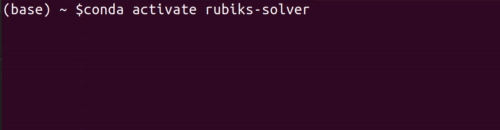</center>


##### Step 2. Input faces
You will need to input each face one at a time by pressing the space
bar after presenting each face. You should do this as follows:

1. input front face (hit space)
2. rotate cube CW around vertical axis to show right face (hit space)
3. rotate cube CW around vertical axis to show back face (hit space)
4. rotate cube CW around vertical axis to show left face (hit space)
5. rotate cube CW around vertical axis to show front face 
6. rotate cube CW around x-axis (i.e. around the right face) to show top face (hit space)
7. rotate cube CCW around x-axis to show bottom face (hit space

The program will then extract all squares that it can find, and will
present you with a dialog to correct any faces it failed to identify.

<center></center>


##### Step 3. Manually extract faces for any failures 
If there were any failures, you will be presented with a dialog
showing the failed face and asked to manually extract the squares from
this image. To manually extract the faces, click on the upper
left-hand corner of the square in the upper left hand corner (this
will start drawing a green square). Next you need to click in the
lower right-hand corner of the square. Repeat for the middle square
and the square in the lower right-hand corner of the face. 

Once you have finished here, the window will change to the result
window. If the result is okay, press the q key to accept, and if not,
press ctrl+z to return to the manual extraction screen (this will also
delete the last square entered). 

Note: at any point, if you don't like the last square you drew, press
ctrl+z to delete it.

<center>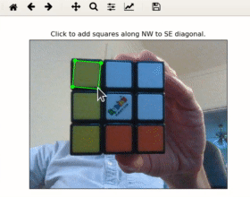</center>

##### Step 4. Checking the results
Once you have manually extracted all of the faces that the program
failed to detect, you will be presented with a screen showing the 6
extracted face images in its top row, and the 6 sets of classified
colors in the bottom row.
 
First inspect the top row to see if there are any mistakes (i.e. check
to see if the computer-vision algorithm messed up and didn't correctly
capture the squares in the image). If there are any mistakes, double
click on the failed image to enter a manual square extraction dialog
and follow the steps described in Step 3.
 
Once you're satisfied with the top row, move on to checking the bottom
row to see if the extracted colors match up with the top row. If any
squares have mistakes, double click on the square and press the type
the first letter of the correct color (e.g. if the square should have
been blue, type "b"). You can press enter once the correct color has
been entered, or just single-click anywhere to stop the color editor.

Once you have verified that all of the colors of the squares correctly
match the input images, press q to exit the results dialog.

<center>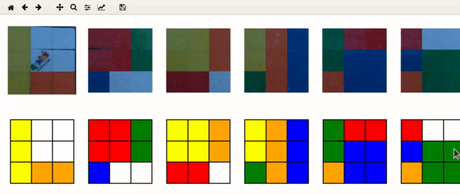</center>

##### Step 5. Viewing the solution
Once you've exited the results dialog, you will be presented with a
Solution Gallery showing the steps required to solve the cube. You can
step through the results using the left and right arrows.
 
Press q to exit, and exit python once you're done.

<center>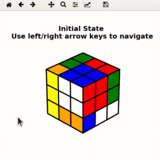</center>

### Instructions (using saved images)
To run using a directory containing files for each of the 6 faces:

    (rubiks-solver) [me@mycomputer]$ python
    >>> import rubiksolver
    >>> rubiksolver.main("/path/to/the/rubiks/cube/images")

The images saved at `/path/to/the/rubiks/cube/images` should satisfy
the following constraints:

1. Each image should only contain a single face.
2. The files must be saved in an ordered fashion, and must be captured
   in the same fashion/order described in Step 2 above.


<!-- ## Status -->

<!-- My aspiration for this project is to implement a solver that provides -->
<!-- step-by-step graphical solution instructions along with some camera -->
<!-- tools to recognize the initial state of the cube (so that I won't have -->
<!-- to manually enter the cube's state). However, as of May 24th 2019, I -->
<!-- haven't implemented an entry method, and I haven't implemented a way -->
<!-- to output the intermediate steps / plot the steps. However, I have -->
<!-- successfully implemented the solver (using [this -->
<!-- method](https://www.rubiks.com/how-to-solve-rubiks-cube)), and some -->
<!-- plotting functions to display the cube's state. I just need to add a -->
<!-- bit on the output / completely add the input and things should be good -->
<!-- (: -->

<!-- ## Example 1: Solving a random initial state (big steps): -->

<!-- As an example, I put the cube into a randomized initial state and let -->
<!-- the solver run, displaying the cube's state after each major solution -->
<!-- step. The solution is pretty similar to [this -->
<!-- method](https://www.rubiks.com/how-to-solve-rubiks-cube). -->

<!-- <p float="center"> -->
<!-- 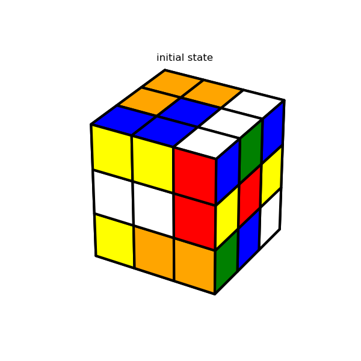 -->
<!-- 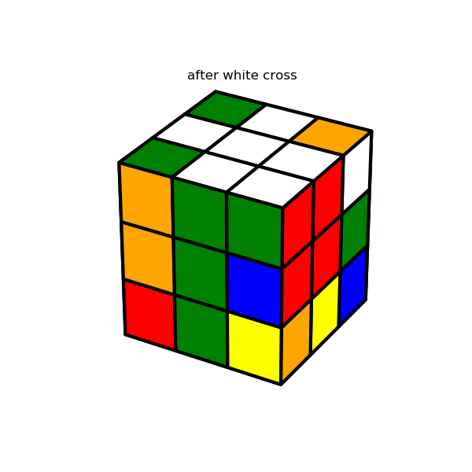 -->
<!-- 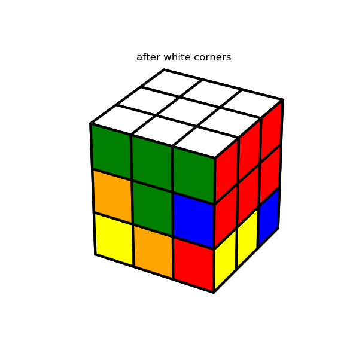 -->
<!-- 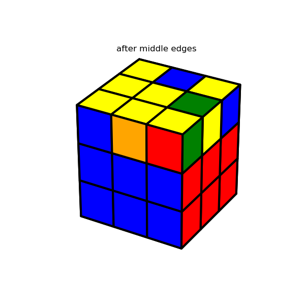 -->
<!-- 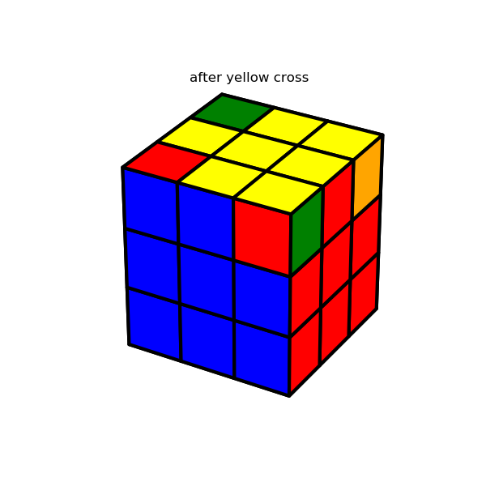 -->
<!-- 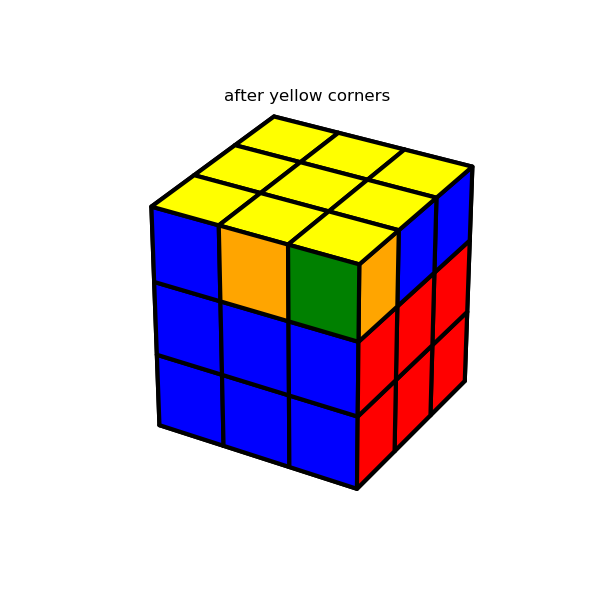 -->
<!-- 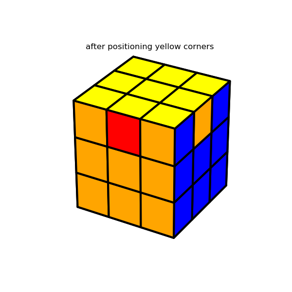 -->
<!-- 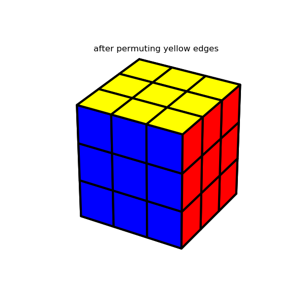 -->
<!-- </p> -->

<!-- ## Example 2: Solving a random initial state (every move): -->

<!-- For a second example, I ran the solver and recorded every move -->
<!-- performed. The result is the gif below: -->

<!-- <p float = "center"> -->
<!-- 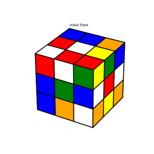 -->
<!-- </p> -->
